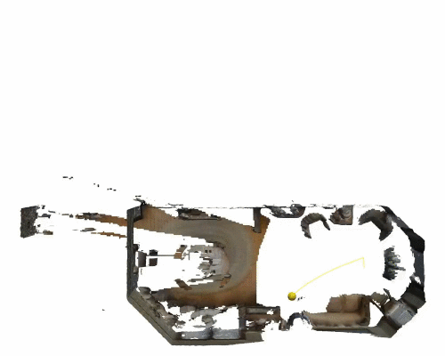
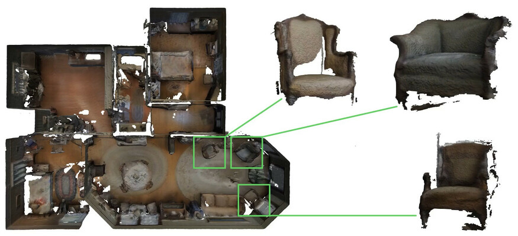

# Finding Things in the Unknown: Semantic Object-Centric Exploration with an MAV

WORK-IN-PROGRESS. Check again in a few days for the full source code.

This repository contains the code and simulator for the ICRA 2023
paper “Finding Things in the Unknown: Semantic Object-Centric
Exploration with an MAV”.

<table style="text-align:center">
  <tr>
    <td></td>
    <td></td>
  </tr>
</table>

In this work we broaden the scope of autonomous exploration beyond just
uncovering free space into creating a map with semantic and object-level
information, useful for higher-level robotic tasks. We study the task of both
finding specific objects in unknown space as well as reconstructing them to a
target level of detail while exploring an unknown environment. We evaluate our
framework on complex environments in our MAV simulator based on Habitat and
on-board a real-world MAV. For more information see the
[paper](https://arxiv.org/abs/2302.14569) and
[video](https://youtu.be/z0LVe_8SATU).


## Build

The code has been tested on [Ubuntu 20.04](https://releases.ubuntu.com/focal/)
and ROS Noetic. Install the `ros-noetic-desktop-full` package by following the
[ROS Noetic installation instructions](http://wiki.ros.org/noetic/Installation/Ubuntu)
and then install the dependencies:

``` sh
sudo apt-get install cmake g++ git libcgal-dev libeigen3-dev libompl-dev libopencv-dev libyaml-cpp-dev python3-catkin-tools
```

Create and initialize a new catkin workspace:

``` sh
source /opt/ros/noetic/setup.bash
mkdir -p ~/exploration_ws/src
cd ~/exploration_ws
catkin init
```

Clone this repository and all submodules inside the workspace:

``` sh
cd ~/exploration_ws/src
git clone --recurse-submodules https://github.com/smartroboticslab/semantic-exploration-icra-2023.git
```

Build all ROS packages in the workspace:

``` sh
catkin build -DCMAKE_BUILD_TYPE=Release
source ~/exploration_ws/devel/setup.bash
```


## Usage

TODO (dataset download, launch files)


## Project structure

This repository consists of several ROS packages:

* `semanticeight_ros`: The mapping and exploration planning node.
* `habitat_mav_sim`: The MAV simulator using the
  [Habitat-Sim](https://aihabitat.org/) simulator.
* `mav_comm`: Message definitions needed when using the
  [RotorS](https://github.com/ethz-asl/rotors_simulator) simulator.


## Citing

If you found the code in this repository useful in your work you can use the
following BibTeX entry to cite it:

``` bibtex
@InProceedings{Papatheodorou_ICRA2023,
  author    = "Papatheodorou, Sotiris and Funk, Nils and Tzoumanikas, Dimos and Choi, Christopher and Xu, Binbin and Leutenegger, Stefan",
  title     = "Finding Things in the Unknown: Semantic Object-Centric Exploration with an {MAV}",
  booktitle = "IEEE International Conference on Robotics and Automation",
  address   = "London, United Kingdom",
  year      = "2023",
  month     = "May",
}
```


## License

Copyright 2020-2023 Smart Robotics Lab, Imperial College London, Technical University of Munich</br>
Copyright 2020-2023 Sotiris Papatheodorou</br>
Copyright 2020-2022 Nils Funk</br>
Copyright 2021-2022 Dimos Tzoumanikas</br>

See the individual submodules for their license terms. Most code is distributed
under the [BSD 3-clause license](LICENSES/BSD-3-Clause.txt).
